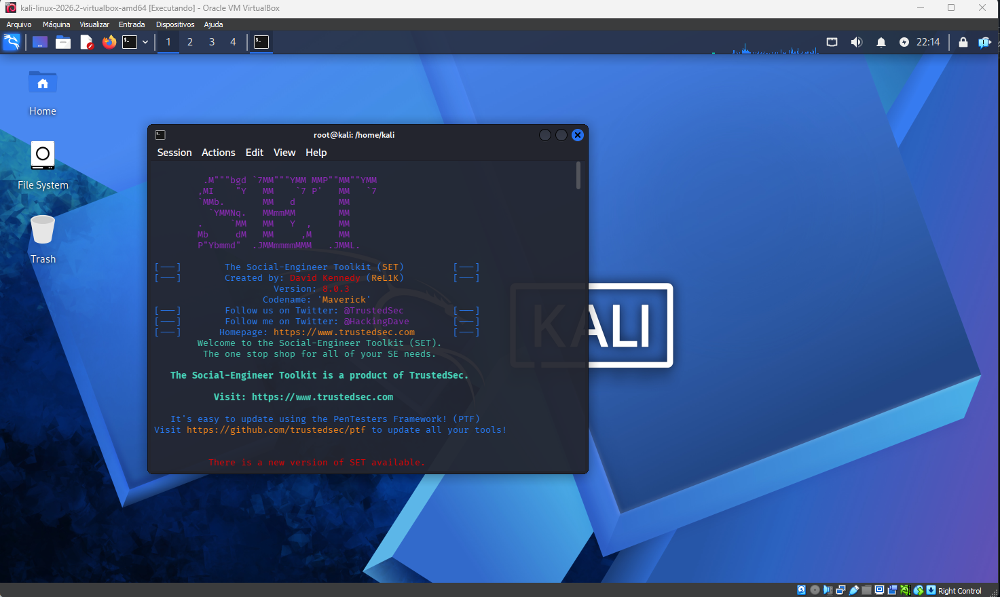
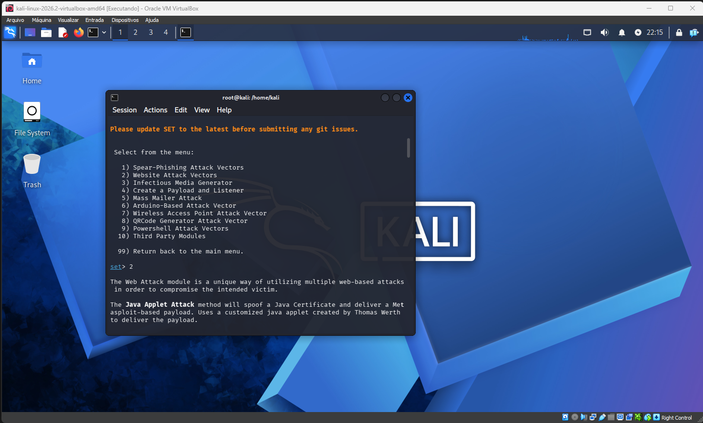
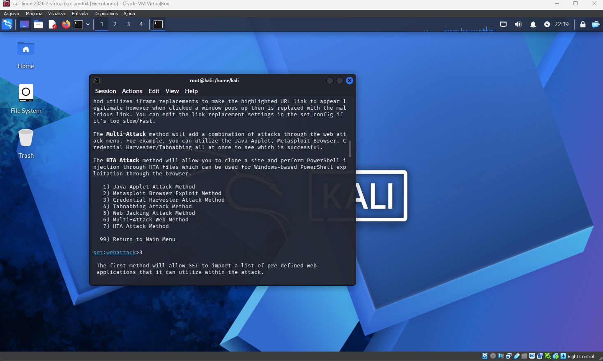
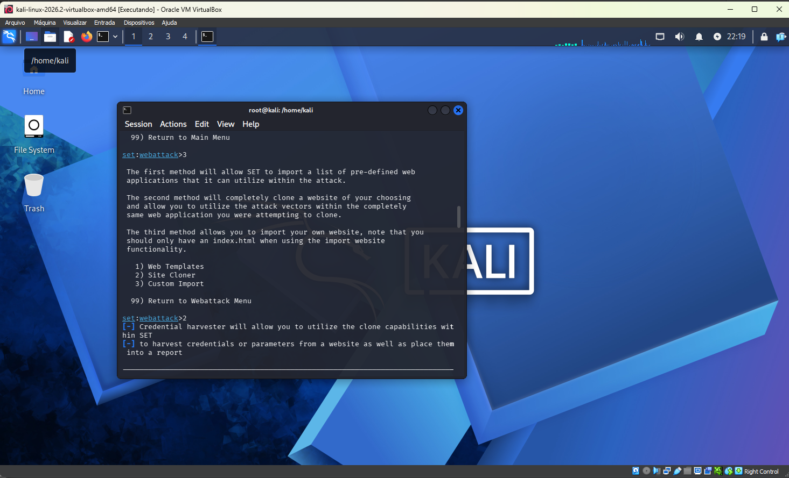
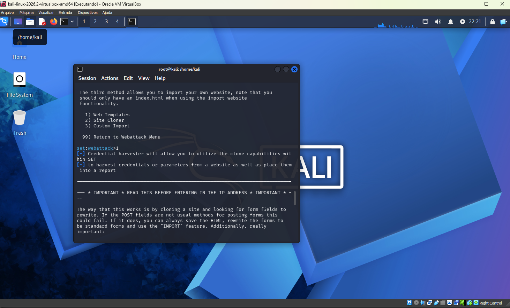
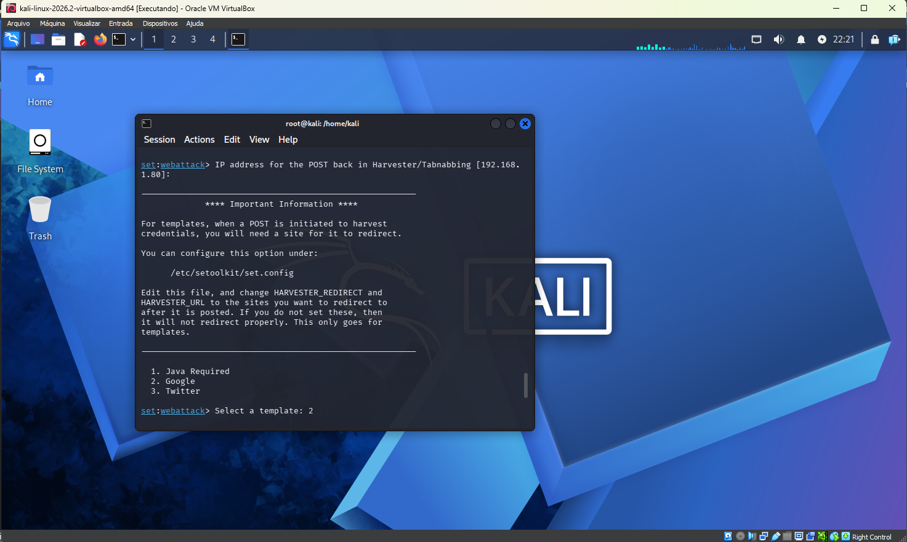
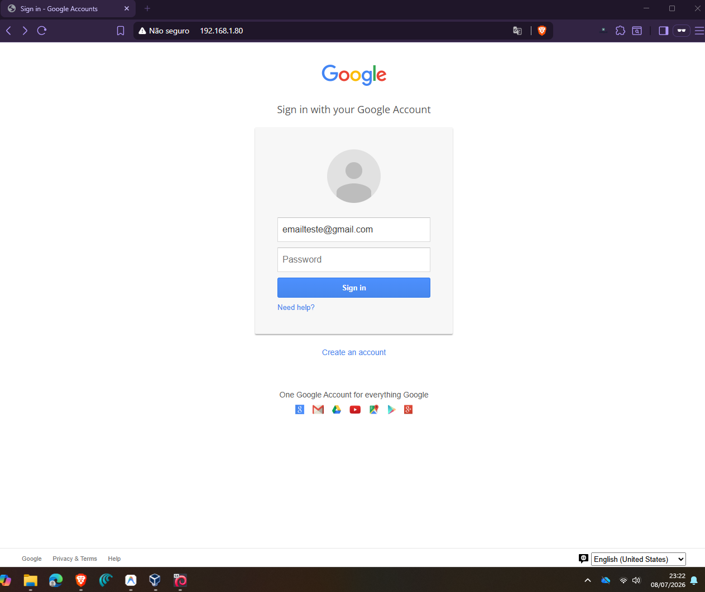

# Phishing-Kali
Simulação de Ataque de Phishing com Kali Linux para Fins Educacionais.

## ⚠️ Aviso de Isenção de Responsabilidade (Disclaimer)
Este projeto foi desenvolvido estritamente para fins acadêmicos, educativos e de conscientização profissional. O uso de técnicas e ferramentas de simulação de ataque sem autorização prévia é ilegal e viola as diretrizes de ética profissional. O autor não se responsabiliza pelo uso indevido das informações aqui apresentadas.

## 📌 Objetivo do Projeto
Apresentar de forma prática o funcionamento de um ataque de engenharia social por meio de Phishing. O intuito é compreender o elo humano na cadeia de segurança da informação e como esse conhecimento ajuda a criar defesas robustas e treinamentos eficientes para ambientes corporativos.

## 🛠️ Ferramentas Utilizadas
*   **Sistema Operacional:** Kali Linux (executado em Máquina Virtual)
*   **Ferramenta de Simulação:** SET (Social-Engineer Toolkit)
*   **Ambiente de Teste:** Rede local isolada (modo Host-Only / Rede Interna)

## 🚀 Passo a Passo Realizado
1. **Inicialização do SET:** Acesso ao menu do Social-Engineer Toolkit via terminal com privilégios de superusuário (`sudo setoolkit`).

2. **Seleção do Tipo de Ataque:** Escolha do módulo de engenharia social (`Social-Engineering Attacks`).

3. **Vetor de Ataque:** Escolha do vetor de ataque via web (`Web Attack Vectors`).

4. **Método de Captura:** Seleção do método de colheita de credenciais (`Credential Harvester Attack Method`).

5. **Escolha da Página:** Uso do modelo pré-configurado (*Web Templates*) para simular a página de login do Google de forma offline e segura no laboratório, este método foi adotado para contornar o erro apresetnado ao clonar a página do Facebook.

6. **Teste de Captura:** Acesso à página clonada a partir de uma máquina de teste na mesma rede e simulação de inserção de credenciais de teste para visualizar a captura dos dados em tempo real no terminal do Kali Linux.

## 🛡️ Como Prevenir este Ataque na Empresa
Para proteger o ambiente corporativo contra ameaças de engenharia social baseadas em Phishing, as seguintes medidas são recomendadas:
*   **Autenticação de Múltiplos Fatores (MFA/2FA):** Garante que mesmo que a senha seja capturada, o invasor não consiga acessar a conta sem o segundo fator de autenticação.
*   **Treinamento de Conscientização:** Realização periódica de simulações internas de phishing para ensinar os colaboradores a identificarem remetentes falsos, links suspeitos e erros de ortografia.
*   **Filtros de E-mail Anti-Phishing (SPF, DKIM e DMARC):** Configurações de DNS que ajudam a validar a identidade dos e-mails recebidos, reduzindo a chance de e-mails falsificados (spoofing) chegarem às caixas de entrada.
*   **Uso de Gerenciadores de Senhas:** Impedem o preenchimento automático de credenciais caso o usuário esteja em um domínio falso que não corresponde ao site legítimo.
